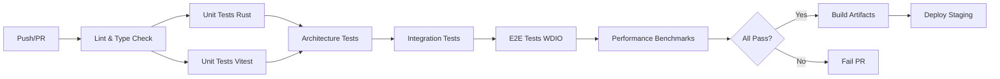

# Phase 7: CI/CD Pipeline Configuration

**Date**: 2026-02-07  
**Version**: v27.4.1  
**Status**: Configuration prête (non déployée)

---

## Architecture Pipeline



---

## Workflows GitHub Actions

### 1. Main Test Suite

**Fichier**: `.github/workflows/test-suite.yml`

```yaml
name: 🧪 Test Suite

on:
  push:
    branches: [main, develop, feature/**]
  pull_request:
    branches: [main, develop]

env:
  NODE_OPTIONS: '--max-old-space-size=12288'
  CARGO_TERM_COLOR: always

jobs:
  # ═══════════════════════════════════════════════════════════════
  #  JOB 1: Lint & Type Safety
  # ═══════════════════════════════════════════════════════════════
  lint:
    name: 🔍 Lint & Type Check
    runs-on: ubuntu-latest
    timeout-minutes: 10
    
    steps:
      - uses: actions/checkout@v4
      
      - name: Setup Node.js
        uses: actions/setup-node@v4
        with:
          node-version: '20'
          cache: 'pnpm'
      
      - name: Setup pnpm
        uses: pnpm/action-setup@v2
        with:
          version: 8
      
      - name: Install dependencies
        run: pnpm install --frozen-lockfile
      
      - name: Run ESLint
        run: pnpm run lint
      
      - name: TypeScript type check
        run: pnpm run typecheck

  # ═══════════════════════════════════════════════════════════════
  #  JOB 2: Rust Unit Tests
  # ═══════════════════════════════════════════════════════════════
  test-rust:
    name: 🦀 Rust Unit Tests
    runs-on: ubuntu-latest
    timeout-minutes: 20
    
    steps:
      - uses: actions/checkout@v4
      
      - name: Setup Rust
        uses: actions-rs/toolchain@v1
        with:
          toolchain: stable
          profile: minimal
          override: true
      
      - name: Cache Cargo
        uses: actions/cache@v4
        with:
          path: |
            ~/.cargo/bin/
            ~/.cargo/registry/index/
            ~/.cargo/registry/cache/
            ~/.cargo/git/db/
            src-tauri/target/
          key: ${{ runner.os }}-cargo-${{ hashFiles('**/Cargo.lock') }}
      
      - name: Run Rust tests
        run: |
          cd src-tauri
          cargo test --workspace --all-features
      
      - name: Upload test results
        if: always()
        uses: actions/upload-artifact@v4
        with:
          name: rust-test-results
          path: src-tauri/target/debug/test-results/

  # ═══════════════════════════════════════════════════════════════
  #  JOB 3: JavaScript/TypeScript Unit Tests
  # ═══════════════════════════════════════════════════════════════
  test-vitest:
    name: ⚡ Vitest Unit Tests
    runs-on: ubuntu-latest
    timeout-minutes: 30
    
    steps:
      - uses: actions/checkout@v4
      
      - name: Setup Node.js
        uses: actions/setup-node@v4
        with:
          node-version: '20'
          cache: 'pnpm'
      
      - name: Setup pnpm
        uses: pnpm/action-setup@v2
        with:
          version: 8
      
      - name: Install dependencies
        run: pnpm install --frozen-lockfile
      
      - name: Run Vitest tests
        run: pnpm test -- --reporter=json --outputFile=test-results.json
      
      - name: Parse test results
        if: always()
        run: |
          PASS_COUNT=$(jq '.testResults | map(.assertionResults | length) | add' test-results.json)
          FAIL_COUNT=$(jq '.numFailedTests' test-results.json)
          echo "✅ Passed: $PASS_COUNT"
          echo "❌ Failed: $FAIL_COUNT"
          
          # Fail if pass rate < 95%
          TOTAL=$((PASS_COUNT + FAIL_COUNT))
          PASS_RATE=$(awk "BEGIN {print ($PASS_COUNT/$TOTAL)*100}")
          if (( $(echo "$PASS_RATE < 95" | bc -l) )); then
            echo "::error::Pass rate ${PASS_RATE}% is below 95% threshold"
            exit 1
          fi
      
      - name: Upload test results
        if: always()
        uses: actions/upload-artifact@v4
        with:
          name: vitest-test-results
          path: test-results.json

  # ═══════════════════════════════════════════════════════════════
  #  JOB 4: Architecture & Compliance Tests
  # ═══════════════════════════════════════════════════════════════
  test-architecture:
    name: 🏛️ Architecture Tests
    runs-on: ubuntu-latest
    timeout-minutes: 10
    needs: [lint]
    
    steps:
      - uses: actions/checkout@v4
      
      - name: Setup Node.js
        uses: actions/setup-node@v4
        with:
          node-version: '20'
          cache: 'pnpm'
      
      - name: Setup pnpm
        uses: pnpm/action-setup@v2
        with:
          version: 8
      
      - name: Install dependencies
        run: pnpm install --frozen-lockfile
      
      - name: Architecture tests
        run: pnpm run test:architecture
      
      - name: Compliance tests
        run: pnpm run test:compliance

  # ═══════════════════════════════════════════════════════════════
  #  JOB 5: E2E Desktop Tests (WDIO)
  # ═══════════════════════════════════════════════════════════════
  test-e2e:
    name: 🖥️ E2E Desktop Tests
    runs-on: ubuntu-latest
    timeout-minutes: 25
    needs: [test-rust, test-vitest, test-architecture]
    
    steps:
      - uses: actions/checkout@v4
      
      - name: Setup Node.js
        uses: actions/setup-node@v4
        with:
          node-version: '20'
          cache: 'pnpm'
      
      - name: Setup pnpm
        uses: pnpm/action-setup@v2
        with:
          version: 8
      
      - name: Setup Rust
        uses: actions-rs/toolchain@v1
        with:
          toolchain: stable
          profile: minimal
      
      - name: Install system dependencies
        run: |
          sudo apt-get update
          sudo apt-get install -y \
            webkit2gtk-4.0 \
            webkit2gtk-driver \
            libayatana-appindicator3-dev \
            librsvg2-dev
      
      - name: Install dependencies
        run: pnpm install --frozen-lockfile
      
      - name: Install tauri-driver
        run: cargo install tauri-driver
      
      - name: Build Tauri app
        run: pnpm run build
      
      - name: Run WDIO E2E tests
        run: pnpm run test:e2e:wdio
      
      - name: Upload E2E artifacts
        if: always()
        uses: actions/upload-artifact@v4
        with:
          name: e2e-test-artifacts
          path: |
            e2e/screenshots/
            e2e/logs/

  # ═══════════════════════════════════════════════════════════════
  #  JOB 6: Performance Benchmarks
  # ═══════════════════════════════════════════════════════════════
  benchmark:
    name: ⚡ Performance Benchmarks
    runs-on: ubuntu-latest
    timeout-minutes: 20
    needs: [test-rust]
    if: github.event_name == 'pull_request'
    
    steps:
      - uses: actions/checkout@v4
        with:
          fetch-depth: 0  # Full history for baseline comparison
      
      - name: Setup Rust
        uses: actions-rs/toolchain@v1
        with:
          toolchain: stable
          profile: minimal
      
      - name: Cache Cargo
        uses: actions/cache@v4
        with:
          path: |
            ~/.cargo/bin/
            ~/.cargo/registry/
            src-tauri/target/
          key: ${{ runner.os }}-cargo-bench-${{ hashFiles('**/Cargo.lock') }}
      
      - name: Run benchmarks
        run: |
          cd src-tauri
          cargo bench --workspace -- --output-format bencher > bench_current.txt
      
      - name: Download baseline
        run: |
          # Fetch baseline from main branch
          git fetch origin main
          git show origin/main:reports/bench_baseline.txt > bench_baseline.txt || echo "No baseline found"
      
      - name: Compare benchmarks
        run: |
          if [ -f bench_baseline.txt ]; then
            python scripts/ci/compare_benchmarks.py bench_current.txt bench_baseline.txt
          else
            echo "No baseline to compare against"
          fi
      
      - name: Comment PR with results
        uses: actions/github-script@v7
        with:
          script: |
            const fs = require('fs');
            const results = fs.readFileSync('bench_comparison.md', 'utf8');
            github.rest.issues.createComment({
              issue_number: context.issue.number,
              owner: context.repo.owner,
              repo: context.repo.repo,
              body: `## ⚡ Performance Benchmark Results\n\n${results}`
            });

  # ═══════════════════════════════════════════════════════════════
  #  JOB 7: Build & Artifacts
  # ═══════════════════════════════════════════════════════════════
  build:
    name: 🔨 Build Artifacts
    runs-on: ubuntu-latest
    timeout-minutes: 30
    needs: [test-e2e]
    if: github.ref == 'refs/heads/main'
    
    steps:
      - uses: actions/checkout@v4
      
      - name: Setup Node.js
        uses: actions/setup-node@v4
        with:
          node-version: '20'
          cache: 'pnpm'
      
      - name: Setup pnpm
        uses: pnpm/action-setup@v2
        with:
          version: 8
      
      - name: Setup Rust
        uses: actions-rs/toolchain@v1
        with:
          toolchain: stable
          profile: minimal
      
      - name: Install dependencies
        run: pnpm install --frozen-lockfile
      
      - name: Build production
        run: pnpm run build:stable
      
      - name: Generate checksums
        run: |
          cd src-tauri/target/release/bundle
          sha256sum *.AppImage *.deb > checksums.txt
      
      - name: Upload artifacts
        uses: actions/upload-artifact@v4
        with:
          name: production-build
          path: |
            src-tauri/target/release/bundle/*.AppImage
            src-tauri/target/release/bundle/*.deb
            src-tauri/target/release/bundle/checksums.txt
          retention-days: 30
```

---

## Workflow 2: IPC Contract Audit

**Fichier**: `.github/workflows/ipc-audit.yml`

```yaml
name: 🔍 IPC Contract Audit

on:
  push:
    branches: [main, develop]
    paths:
      - 'src/services/tauri/**'
      - 'src-tauri/src/**'
  pull_request:
    paths:
      - 'src/services/tauri/**'
      - 'src-tauri/src/**'

jobs:
  audit:
    name: Audit IPC Contracts
    runs-on: ubuntu-latest
    
    steps:
      - uses: actions/checkout@v4
      
      - name: Setup Node.js
        uses: actions/setup-node@v4
        with:
          node-version: '20'
      
      - name: Run IPC audit
        run: node scripts/audit/audit-ipc-contracts.js
      
      - name: Check results
        run: |
          ISSUES=$(jq '.validationIssues' reports/IPC_CONTRACT_AUDIT.json)
          if [ "$ISSUES" -ne 0 ]; then
            echo "::error::IPC audit found $ISSUES validation issues"
            exit 1
          fi
          echo "✅ IPC audit passed: 0 validation issues"
```

---

## Workflow 3: Nightly Performance Tracking

**Fichier**: `.github/workflows/nightly-perf.yml`

```yaml
name: 🌙 Nightly Performance Tracking

on:
  schedule:
    - cron: '0 2 * * *'  # 2 AM UTC daily
  workflow_dispatch:

jobs:
  track-performance:
    name: Track Performance Metrics
    runs-on: ubuntu-latest
    
    steps:
      - uses: actions/checkout@v4
      
      - name: Setup Rust
        uses: actions-rs/toolchain@v1
        with:
          toolchain: stable
      
      - name: Run benchmarks
        run: |
          cd src-tauri
          cargo bench --workspace -- --output-format bencher > nightly_bench.txt
      
      - name: Store results
        run: |
          DATE=$(date +%Y-%m-%d)
          mkdir -p reports/performance/nightly
          cp nightly_bench.txt reports/performance/nightly/$DATE.txt
      
      - name: Commit results
        run: |
          git config user.name "GitHub Actions"
          git config user.email "actions@github.com"
          git add reports/performance/nightly/
          git commit -m "chore: nightly performance tracking $(date +%Y-%m-%d)"
          git push
```

---

## Scripts de Support

### `scripts/ci/compare_benchmarks.py`

```python
#!/usr/bin/env python3
"""
Compare benchmark results and detect regressions
Exit code 1 if regression > 10%
"""

import sys
import re

def parse_bench_file(filename):
    results = {}
    with open(filename) as f:
        for line in f:
            # Format: test bench_name ... bench: 123 ns/iter (+/- 5)
            match = re.search(r'test (\w+).*bench:\s+(\d+)', line)
            if match:
                results[match.group(1)] = int(match.group(2))
    return results

def main():
    if len(sys.argv) != 3:
        print("Usage: compare_benchmarks.py current.txt baseline.txt")
        sys.exit(1)
    
    current = parse_bench_file(sys.argv[1])
    baseline = parse_bench_file(sys.argv[2])
    
    regressions = []
    for name, cur_time in current.items():
        if name in baseline:
            base_time = baseline[name]
            delta = ((cur_time - base_time) / base_time) * 100
            
            if delta > 10:
                regressions.append((name, delta, base_time, cur_time))
    
    if regressions:
        print("❌ Performance regressions detected:")
        for name, delta, base, cur in regressions:
            print(f"  - {name}: {base}ns → {cur}ns (+{delta:.1f}%)")
        sys.exit(1)
    else:
        print("✅ No significant performance regressions")

if __name__ == '__main__':
    main()
```

---

## Configuration Requise

### Secrets GitHub

```
# Settings > Secrets and variables > Actions

TAURI_SIGNING_KEY       # Si signature AppImage activée
DEPLOY_SSH_KEY          # Pour déploiement artifacts
PERFORMANCE_WEBHOOK_URL # Webhook alertes perf (optionnel)
```

### Branch Protection Rules

```
# Settings > Branches > main

✅ Require status checks to pass before merging
   - lint
   - test-rust
   - test-vitest
   - test-architecture
   - test-e2e

✅ Require linear history
✅ Do not allow bypassing the required status checks
```

---

## Métriques & Monitoring

### Dashboard CI/CD

Les métriques suivantes doivent être trackées:

- **Test Success Rate**: ≥ 95% (tolérance: 90% warning)
- **CI Duration**: < 30 min total (target: 20 min)
- **Flaky Tests**: < 2% de flake rate
- **Performance Drift**: < 5% par semaine

### Alertes

- Échec de test sur `main` → Slack #ci-alerts
- Régression perf > 10% → Email tech leads
- Flaky test détecté → GitHub Issue auto-créée

---

## Prochaines Étapes (Phase 8)

Une fois le pipeline configuré:
1. Valider localement avec `act` (GitHub Actions local)
2. Merger dans `main` avec workflows activés
3. Monitorer premières exécutions
4. Ajuster timeouts/thresholds si nécessaire
5. Documenter dans rapport final
