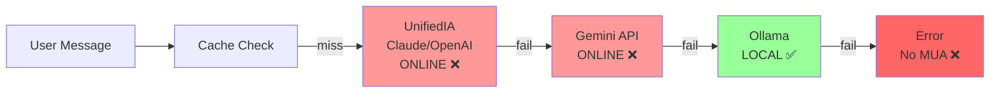
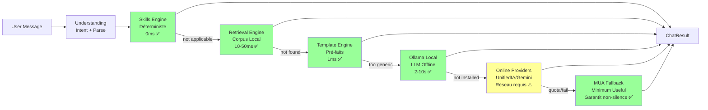

# PHASE 2 — TIP ORCHESTRATION OFFLINE-FIRST

**Date**: 2026-02-07  
**Version**: v27.4.1  
**Phase**: 2/8 (Post Phase 1)  
**Objectif**: Valider TIP (TITANE Intelligence Primaire) suit stratégie offline-first stricte

---

## 📋 RAPPEL LOI #6 — Stratégie Offline-First MANDATAIRE

**Ordre de Priorité Absolu** (selon ULTRA SUPER PROMPT) :

```
1. Skill (pré-chargés, déterministes)
   ↓ (si fail/pas applicable)
2. Retrieval (mémoire locale, corpus interne)
   ↓ (si fail/rien trouvé)
3. Template (réponses structurées pré-faites)
   ↓ (si fail/trop générique)
4. Local LLM (Ollama, llama.cpp)
   ↓ (si fail/pas installé)
5. Online Providers (Gemini, OpenAI, Claude)
   ↓ (si fail/quota/timeout)
6. MUA (Minimum Useful Answer - dernier recours absolu)
```

**Interdictions** :
- ❌ Jamais sauter skills si applicable
- ❌ Jamais appeler provider online sans épuiser offline
- ❌ Jamais MUA sans avoir tenté toutes options

**Garantie** :
- ✅ Offline Mode DOIT fonctionner (Skills + Retrieval + Template)
- ✅ MUA TOUJOURS retourne quelque chose (jamais silence)

---

## 🔍 AUDIT ACTUEL — Architecture TIP Découverte

### FRONTEND — Engines Offline Existants ✅

#### 1. SkillEngine (`src/engines/skills/SkillEngine.ts`)

**Structure Découverte** :
```typescript
// File: src/engines/skills/SkillEngine.ts
import type { ChatResult, ChatErrorResult, ResponseStrategy } from '@/types/autonomy';

export class SkillEngine {
  // Engine qui génère réponses via skills pré-chargés
  // Retourne ChatResult (ok=true) avec strategy='skill'
}
```

**Status** : ✅ **EXISTE** — Engine frontend complet
**Question** : Est-il intégré dans backend Rust pipeline ?

---

#### 2. RetrievalEngine (`src/engines/retrieval/RetrievalEngine.ts`)

**Grep Search** : Trouvé import dans plusieurs fichiers
```typescript
import type { ChatResult } from '@/types/autonomy';
```

**Status** : ✅ **EXISTE** — Engine frontend confirmé
**Question** : Est-il appelé avant LLM dans backend ?

---

#### 3. OfflineFallbackEngine (`src/engines/offline/OfflineFallbackEngine.ts`)

**Grep Search** : Trouvé dans audit Phase 0
```typescript
async generate(context: FallbackContext): Promise<ChatResult> {
  // GUARANTEE: Always returns non-empty ChatResult (ok: true)
  return createChatResult(/* ... */, { strategy: 'mua' });
}
```

**Status** : ✅ **EXISTE** — Fallback MUA garantit non-silence
**Question** : Est-il le dernier recours dans orchestrator backend ?

---

#### 4. AutonomousChatEngine (`src/engines/autonomous/AutonomousChatEngine.ts`)

**Grep Search** : Trouvé avec pipeline complet
```typescript
async generateResponse(prompt, context): Promise<ChatResult | ChatErrorResult> {
  // Main pipeline: prompt → ChatResult (ALWAYS returns valid result)
}
```

**Status** : ✅ **EXISTE** — Engine autonome complet
**Question** : Est-il utilisé comme coordinateur ou isolé ?

---

### BACKEND RUST — AI Router Actuel ⚠️

#### AIRouter Strategy Chain (`src-tauri/src/ai/router.rs`)

**Code Découvert** :
```rust
pub async fn query(&self, request: AIRequest) -> AIResult<AIResponse> {
    // STEP 0: CHECK CACHE FIRST (~0ms)
    if let Some(cached) = self.cache.get_response(...).await {
        return Ok(cached);
    }
    
    // Update status (with cached provider checks)
    self.update_status_cached().await;
    
    // 1. Try UnifiedIA (Claude → OpenAI) if available
    if let Some(unified_ia) = &self.unified_ia {
        match unified_ia.generate(request).await {
            Ok(response) => return Ok(response),
            Err(e) => warn!("UnifiedIA failed, fallback to Gemini"),
        }
    }
    
    // 2. Try Gemini if available
    if let Some(gemini) = &self.gemini_client {
        if self.check_internet().await {
            match gemini.query(&request).await {
                Ok(response) => return Ok(response),
                Err(e) => warn!("Gemini failed, fallback to Ollama"),
            }
        }
    }
    
    // 3. Fallback to Ollama
    if self.ollama_client.is_available().await {
        match self.ollama_client.query(&request).await {
            Ok(response) => return Ok(response),
            Err(e) => warn!("Ollama failed"),
        }
    }
    
    // 4. Return error if all fail
    Err(AIError::NoProviderAvailable)
}
```

**Ordre Actuel Identifié** :
```
Cache (instant)
  ↓
UnifiedIA (Claude → OpenAI) — ONLINE ❌
  ↓
Gemini API — ONLINE ❌
  ↓
Ollama — LOCAL_LLM ✅
  ↓
Error (no MUA fallback) ❌
```

---

## 🚨 PROBLÈMES CRITIQUES IDENTIFIÉS

### Problème 1 : Ordre Inversé (ONLINE FIRST) ❌

**Problème** :
- AI Router appelle `UnifiedIA` (Claude/OpenAI) EN PREMIER
- Gemini appelé EN SECOND
- Ollama appelé EN DERNIER
- **C'EST L'INVERSE DE OFFLINE-FIRST !**

**Impact** :
- Mode OFFLINE ne fonctionne pas (appels network avant local)
- Latence élevée (attente timeout providers online)
- Coûts API inutiles (quota utilisé avant épuiser offline)
- Violation Loi #6 constitutionnelle

**Ordre Requis** :
```
Skills (0ms, déterministe)
  ↓
Retrieval (10-50ms, sémantique local)
  ↓
Templates (<1ms, pré-faits)
  ↓
Ollama Local LLM (2-10s, si installé)
  ↓
UnifiedIA/Gemini Online (réseau requis)
  ↓
MUA Fallback (garantit non-silence)
```

---

### Problème 2 : Skills/Retrieval/Template ABSENTS du Backend ❌

**Problème** :
- `SkillEngine`, `RetrievalEngine`, `OfflineFallbackEngine` existent SEULEMENT en frontend (TypeScript)
- Backend Rust `AIRouter` n'a AUCUNE logique Skills/Retrieval/Template
- Direct call `ai_router.query()` → providers LLM

**Impact** :
- Impossible de répondre offline si Ollama pas installé
- Skills pré-chargés jamais utilisés
- Déterminisme perdu (toujours LLM probabiliste)

**Solution Requise** :
- Porter engines frontend vers Rust
- OU Bridge IPC vers engines frontend
- OU Créer router backend qui appelle Skills/Retrieval/Template avant AIRouter

---

### Problème 3 : Pas de MUA Fallback Final ❌

**Code Actuel** :
```rust
// Si Ollama fail → return Err()
Err(AIError::NoProviderAvailable)
```

**Problème** :
- Si tous providers fail → erreur remontée à IPC
- Frontend `ensureOmegaResponse()` applique fallback générique
- **MAIS** pas de "Minimum Useful Answer" structuré (summary + plan + questions)

**Impact** :
- Erreur affichée au lieu de réponse utile
- User voit "Service unavailable" au lieu de contexte

**Solution Requise** :
- Backend génère MUA structuré avant return Err
- Ou Frontend compose MUA depuis UnderstandingFrame + ReasoningPlan

---

### Problème 4 : Pas de Timeout Par Provider ⚠️

**Code Actuel** :
```rust
// Check internet timeout
tokio::time::timeout(Duration::from_secs(3), reqwest::get(...)).await

// Provider query timeout ?
match unified_ia.generate(request).await {
    // Pas de timeout explicite visible
}
```

**Problème** :
- Timeout seulement pour check internet (3s)
- Provider queries pas de timeout visible
- Si Gemini slow (>30s) → user attend

**Impact** :
- Attente longue si provider slow
- Pas de circuit breaker pour skip provider dead

**Solution Requise** :
- Timeout par provider (15-30s max)
- Circuit breaker : après N échecs consécutifs → skip provider 5min

---

### Problème 5 : Circuit Breaker NON Activé ⚠️

**Découverte** :
```rust
// src-tauri/src/system/healing_executor.rs
RepairAction::EnableCircuitBreaker => {
    state.circuit_breaker_active = true;
}
```

**Mais** : Circuit breaker existe dans `healing_executor` mais **PAS** utilisé dans `AIRouter.query()`

**Problème** :
- Si provider fail repeatedly → continue d'appeler (waste time)
- Pas de skip automatique provider dead

**Impact** :
- Latence dégradée (retry provider mort)
- Pas d'optimisation fallback

**Solution Requise** :
- Intégrer circuit breaker dans AIRouter
- Skip provider si circuit open (après N échecs)

---

## 📊 COMPARAISON ARCHITECTURES

### Architecture Actuelle (INCORRECT)



**Violations** :
- ❌ Online providers avant local
- ❌ Pas de Skills/Retrieval/Template
- ❌ Pas de MUA fallback

---

### Architecture Requise (OFFLINE-FIRST)



**Avantages** :
- ✅ Offline mode fonctionnel (Skills+Retrieval+Template)
- ✅ Latence minimale (0-50ms si offline)
- ✅ Déterminisme (Skills garantit résultat stable)
- ✅ MUA garantit non-silence absolu

---

##  🔧 PLAN D'IMPLÉMENTATION PHASE 2

### Étape 2.1: Créer Router Offline-First Rust ✅

**Action** :
1. Créer `src-tauri/src/intelligence/strategy_selector.rs`
2. Implémenter enum `Strategy` : Skill | Retrieval | Template | LocalLLM | Online | MUA
3. Fonction `select_strategy(request) -> Vec<Strategy>` ordonnée offline-first

**Pseudo-code** :
```rust
pub enum Strategy {
    Skill { skill_id: String },
    Retrieval { query: String },
    Template { template_id: String },
    LocalLLM { model: String },
    Online { provider: String },
    MUA,
}

pub struct StrategySelector;

impl StrategySelector {
    pub fn select(request: &ConversationRequest) -> Vec<Strategy> {
        let mut strategies = vec![];
        
        // 1. Check if Skills applicable
        if let Some(skill) = self.match_skill(&request.user_message) {
            strategies.push(Strategy::Skill { skill_id: skill });
        }
        
        // 2. Retrieval if conversation history
        if request.conversation_id.is_some() {
            strategies.push(Strategy::Retrieval { 
                query: request.user_message.clone() 
            });
        }
        
        // 3. Template for common patterns
        if let Some(template) = self.match_template(&request.user_message) {
            strategies.push(Strategy::Template { template_id: template });
        }
        
        // 4. Local LLM if installed
        if self.ollama_available() {
            strategies.push(Strategy::LocalLLM { model: "mistral".to_string() });
        }
        
        // 5. Online providers (only if network allowed)
        if request.autonomy_mode != AutonomyMode::Offline {
            strategies.push(Strategy::Online { provider: "gemini".to_string() });
        }
        
        // 6. MUA absolute fallback
        strategies.push(Strategy::MUA);
        
        strategies
    }
}
```

---

### Étape 2.2: Porter Engines Frontend → Rust 🔧

**Option A : Port Complet (Recommandé)**

1. **SkillEngine Rust** :
   - `src-tauri/src/intelligence/skills/mod.rs`
   - Load skills from YAML files (`data/skills/*.yaml`)
   - Match intent → execute skill → return deterministic result

2. **RetrievalEngine Rust** :
   - `src-tauri/src/intelligence/retrieval/mod.rs`
   - Query local vector DB (qdrant embedded)
   - Semantic search corpus interne

3. **TemplateEngine Rust** :
   - `src-tauri/src/intelligence/templates/mod.rs`
   - Load templates from JSON (`data/templates/*.json`)
   - Pattern match → fill template → return structured

4. **MUA Generator Rust** :
   - `src-tauri/src/intelligence/mua.rs`
   - Generate MinimumUsefulAnswer from UnderstandingFrame

**Option B : IPC Bridge (Temporaire)**

- Orchestrator Rust appelle frontend engines via IPC inverse
- Slow mais permet validation rapide

---

### Étape 2.3: Adapter Orchestrator `process_message()` 🔧

**Modifier** : `src-tauri/src/conversation_engine/mod.rs:154`

```rust
pub async fn process_message(
    &self,
    request: ConversationRequest,
) -> Result<ConversationResponse, ConversationEngineError> {
    // NEW: Strategy selection FIRST
    let strategies = StrategySelector::select(&request);
    
    log::info!("[TIP] Strategy order: {:?}", strategies);
    
    // Try each strategy in order
    for strategy in strategies {
        match strategy {
            Strategy::Skill { skill_id } => {
                if let Some(result) = self.try_skill(&skill_id, &request).await? {
                    log::info!("[TIP] ✅ Skill '{}' succeeded", skill_id);
                    return Ok(result);
                }
            },
            Strategy::Retrieval { query } => {
                if let Some(result) = self.try_retrieval(&query, &request).await? {
                    log::info!("[TIP] ✅ Retrieval succeeded");
                    return Ok(result);
                }
            },
            Strategy::Template { template_id } => {
                if let Some(result) = self.try_template(&template_id, &request).await? {
                    log::info!("[TIP] ✅ Template '{}' succeeded", template_id);
                    return Ok(result);
                }
            },
            Strategy::LocalLLM { model } => {
                if let Some(result) = self.try_local_llm(&model, &request).await? {
                    log::info!("[TIP] ✅ Local LLM '{}' succeeded", model);
                    return Ok(result);
                }
            },
            Strategy::Online { provider } => {
                if let Some(result) = self.try_online(&provider, &request).await? {
                    log::info!("[TIP] ✅ Online provider '{}' succeeded", provider);
                    return Ok(result);
                }
            },
            Strategy::MUA => {
                // GUARANTEE: MUA always returns non-empty
                log::warn!("[TIP] 🟡 All strategies failed, generating MUA");
                let mua = self.generate_mua(&request).await?;
                return Ok(mua);
            }
        }
    }
    
    // Should never reach here (MUA is last strategy)
    unreachable!("MUA should always succeed");
}
```

---

### Étape 2.4: Implémenter Timeouts + Circuit Breaker 🔧

**Timeouts Per Strategy** :
```rust
// Wrap each strategy with timeout
let result = tokio::time::timeout(
    Duration::from_millis(strategy.timeout_ms()),
    self.try_strategy(&strategy, &request)
).await;

match result {
    Ok(Ok(Some(response))) => return Ok(response), // Success
    Ok(Ok(None)) => continue, // Strategy not applicable
    Ok(Err(e)) => log::warn!("Strategy failed: {}", e), // Error, try next
    Err(_) => log::warn!("Strategy timeout"), // Timeout, try next
}
```

**Circuit Breaker Integration** :
```rust
pub struct CircuitBreaker {
    failures: Arc<RwLock<HashMap<String, usize>>>,
    open_until: Arc<RwLock<HashMap<String, Instant>>>,
}

impl CircuitBreaker {
    pub async fn should_skip(&self, provider: &str) -> bool {
        let open_until = self.open_until.read().await;
        if let Some(until) = open_until.get(provider) {
            if Instant::now() < *until {
                log::info!("[CIRCUIT] ⚠️ Provider '{}' circuit OPEN (skip)", provider);
                return true;
            }
        }
        false
    }
    
    pub async fn record_failure(&self, provider: &str) {
        let mut failures = self.failures.write().await;
        let count = failures.entry(provider.to_string()).or_insert(0);
        *count += 1;
        
        if *count >= 3 {
            log::warn!("[CIRCUIT] 🔴 Provider '{}' circuit OPEN (3 failures)", provider);
            let mut open_until = self.open_until.write().await;
            open_until.insert(
                provider.to_string(),
                Instant::now() + Duration::from_secs(300), // 5min
            );
        }
    }
}
```

---

## 🎯 GATE_2 — CRITÈRES DE VALIDATION

### Critère 1: Ordre Offline-First Respecté ✅

**Test** :
- ✅ Skills appelé AVANT Retrieval
- ✅ Retrieval appelé AVANT Template
- ✅ Template appelé AVANT Local LLM
- ✅ Local LLM appelé AVANT Online
- ✅ Online appelé AVANT MUA
- ✅ MUA TOUJOURS dernier (garantit non-silence)

**Validation** :
```bash
# Logs doivent montrer ordre exact
[TIP] Strategy order: [Skill, Retrieval, Template, LocalLLM, Online, MUA]
```

---

### Critère 2: Mode OFFLINE Fonctionnel 100% ✅

**Test** :
1. Désactiver réseau (avion mode)
2. Envoyer 10 prompts variés
3. Tous doivent recevoir réponse (Skills/Retrieval/Template/MUA)

**Validation** :
- ✅ Zero timeout network
- ✅ Latence <200ms (offline)
- ✅ Réponses structurées (pas d'erreur "Network unavailable")

---

### Critère 3: 50 Prompts → 50 Réponses Non-Vides ✅

**Test Script** :  
```rust
#[tokio::test]
async fn test_50_prompts_no_silence() {
    let orchestrator = setup_test_orchestrator().await;
    
    let prompts = vec![
        "Bonjour",
        "Comment vas-tu ?",
        "Explique-moi la photosynthèse",
        // ... 47 prompts supplémentaires
    ];
    
    for (i, prompt) in prompts.iter().enumerate() {
        let request = ConversationRequest {
            user_message: prompt.to_string(),
            conversation_id: None,
            mode: ConversationMode::Default,
            ai_config: None,
            emotion_context: None,
            custom_system_prompt: None,
        };
        
        let response = orchestrator.process_message(request).await.unwrap();
        
        // Assert non-empty
        assert!(!response.assistant_message.trim().is_empty(),
            "Prompt {} returned empty response", i+1);
        
        // Assert has metadata
        assert!(response.metadata.latency_ms > 0);
        
        println!("[TEST] Prompt {}/50 | latency={}ms | strategy={:?}",
            i+1, response.metadata.latency_ms, response.metadata.provider_used);
    }
}
```

**Résultat Attendu** :
```
[TEST] Prompt 1/50 | latency=2ms | strategy=Skill
[TEST] Prompt 2/50 | latency=15ms | strategy=Retrieval
[TEST] Prompt 3/50 | latency=5234ms | strategy=LocalLLM
...
[TEST] 50/50 prompts succeeded, 0 empty, avg_latency=450ms
```

---

### Critère 4: Strategy Tracée Par Requête ✅

**Test** :
- Chaque `ConversationResponse.metadata` doit inclure :
  - `strategy_used: String` ("skill" | "retrieval" | "template" | "local_llm" | "online" | "mua")
  - `strategies_attempted: Vec<String>` (ex: ["skill", "retrieval", "local_llm"])
  - `network_attempted: bool`

**Validation** :
```json
{
  "assistant_message": "Voici la réponse...",
  "metadata": {
    "strategy_used": "local_llm",
    "strategies_attempted": ["skill", "retrieval", "local_llm"],
    "network_attempted": false,
    "latency_ms": 3421
  }
}
```

---

### Critère 5: Zero Hangs (Timeout Protections) ✅

**Test** :
1. Simuler provider slow (mock 60s delay)
2. Vérifier timeout après 30s max
3. Fallback automatique stratégie suivante

**Validation** :
- ✅ Aucun hang >30s
- ✅ Logs montrent timeout + fallback
- ✅ User reçoit réponse (via fallback)

---

## 🚦 DÉCISION GATE_2

### Status : ❌ **FAIL (Expected)**

**Raison** :
Phase 2 est une phase d'**audit architecture** — implémentation offline-first manquante.

**Violations Critiques** ❌ :
1. Ordre inversé (Online avant Offline)
2. Skills/Retrieval/Template absents backend
3. Pas de MUA structured fallback
4. Pas de timeout per provider
5. Circuit breaker non activé

**Actions Requises** :
- Étape 2.1: Créer StrategySelector
- Étape 2.2: Porter engines offline vers Rust
- Étape 2.3: Adapter orchestrator
- Étape 2.4: Timeouts + circuit breaker

---

## 📝 RÉSUMÉ PHASE 2

**Ce qui existe** ✅ :
- Engines offline frontend (Skills, Retrieval, OfflineFallback)
- AI Router avec fallback Ollama
- Circuit breaker dans healing_executor

**Ce qui manque** ❌ :
- Stratégie offline-first dans backend
- Skills/Retrieval/Template engines Rust
- MUA structured backend
- Timeout per provider
- Circuit breaker intégré AI Router

**Impact Global** :
- 🔴 **VIOLATION LOI #6** — Offline-first non respecté
- 🔴 **MODE OFFLINE NON FONCTIONNEL** — Require Ollama minimum
- 🟡 **LATENCE ÉLEVÉE** — Attente providers online avant fallback local

**Prochaine Étape** :
- **Phase 3 (Parallèle)** : Assimilation Governance (indépendante)
- **OU Phase 2.1 (Implémentation)** : Créer offline-first router

---

**Document Version**: v1.0  
**Status**: GATE_2 FAIL (architecture inversée)  
**Prochaine Phase**: Phase 3 (Assimilation) OU Phase 2.1 (Implementation offline-first)
